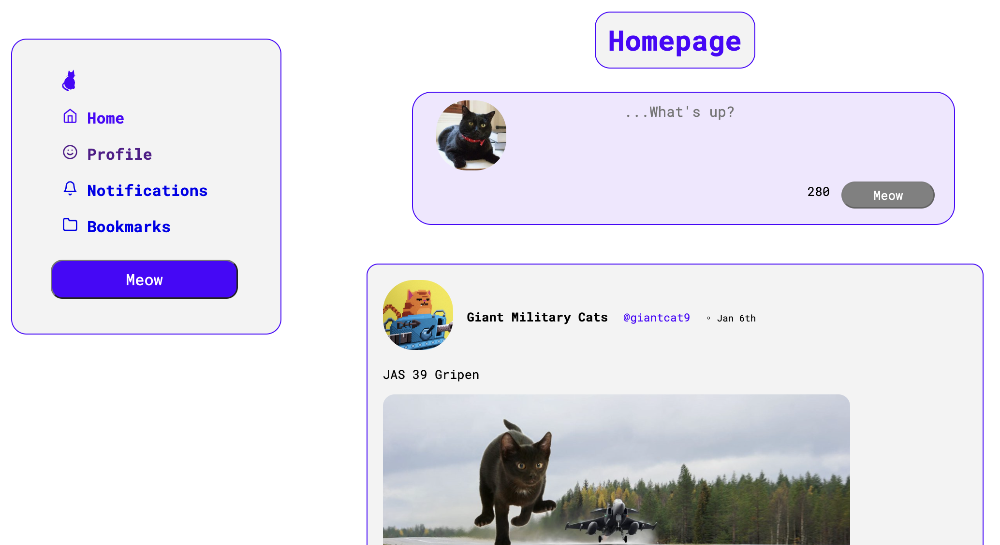

# Critter Twitter Clone (Concordia Project)
This project was completed as a part of our React module. Backend code was provided by Concordia and designing the frontend was the project goal. A STRETCH folder remains with work that can still be completed on this project. 

**Critter API docs**

The Critter API is a REST API for a Twitter clone. It offers a limited subset of the kinds of things you can do on Twitter.

There is no user authentication. Instead, a hardcoded user is always logged in, `treasurymog`. You cannot log out, or switch users.

Some aspects of this API design are a little strange, and this is by design; often, APIs are a bit quirky, and learning how to use documentation to work with those quirks is a valuable skill :)

> NOTE: Certain endpoints will fail about 5% of the time, with an unknown server error. Make sure you're handling these failures on the client!